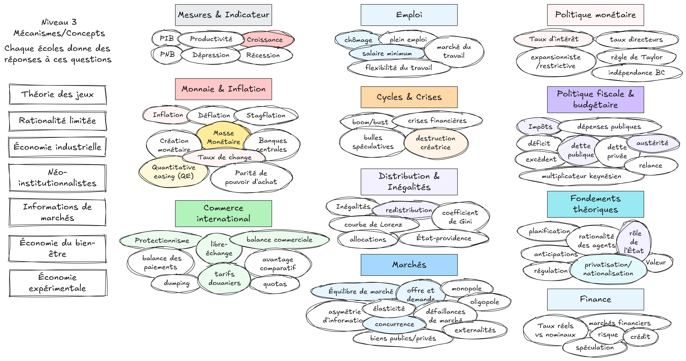

---
layout:
  width: default
  title:
    visible: true
  description:
    visible: false
  tableOfContents:
    visible: true
  outline:
    visible: true
  pagination:
    visible: true
  metadata:
    visible: true
---

# Mécanismes

<figure><figcaption>
Mécanismes et Concepts
</figcaption></figure>
