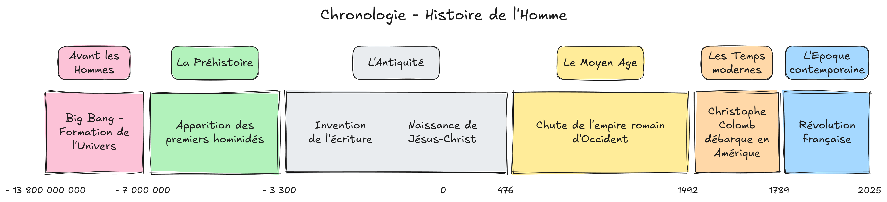

---
layout:
  width: default
  title:
    visible: true
  description:
    visible: false
  tableOfContents:
    visible: true
  outline:
    visible: true
  pagination:
    visible: true
  metadata:
    visible: true
---

# Histoire

<figure><figcaption></figcaption></figure>

**Sources:**

* [Soutien67 - Frise chronologique](https://soutien67.fr/histoire/chronologie/chronologie.htm#Avant)
* [Citeco - 10000 ans d'histoire économique](https://www.citeco.fr/10000-ans-histoire-economie)
* [Inrap - Frise chronologique](https://frise-chronologique.inrap.fr/)
* [Francois Grelaud - Chronologie des grandes dates historiques](https://francois-grelaud.e-monsite.com/)

**Pour aller plus loin:**

* [L'Antiquité en cartes animées - herodote.net](https://www.herodote.net/Vincent_Boqueho_raconte_la_haute_Antiquite-synthese-1941-436.php)
