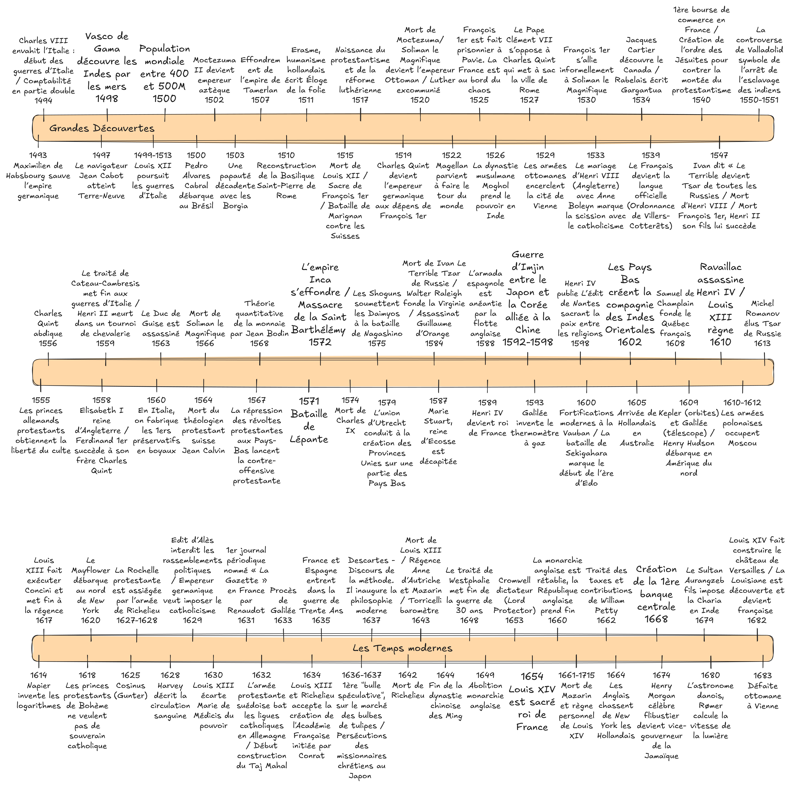
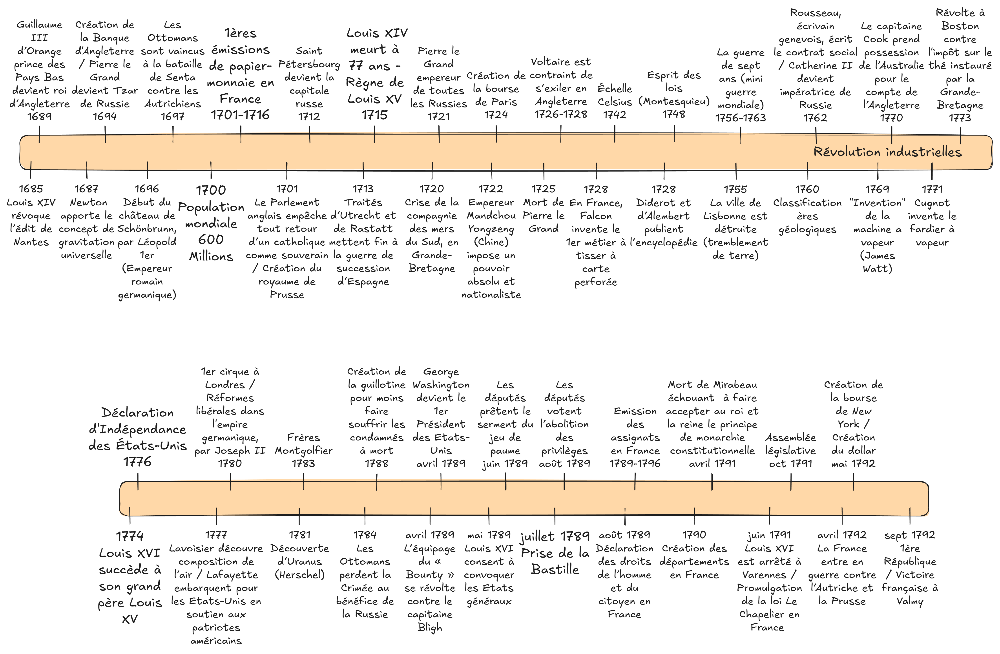

---
layout:
  width: default
  title:
    visible: true
  description:
    visible: false
  tableOfContents:
    visible: true
  outline:
    visible: true
  pagination:
    visible: true
  metadata:
    visible: true
---

# Les Temps modernes

<figure><figcaption></figcaption></figure>

<figure><figcaption></figcaption></figure>
